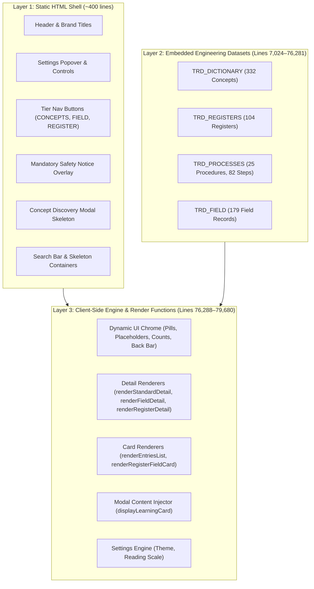
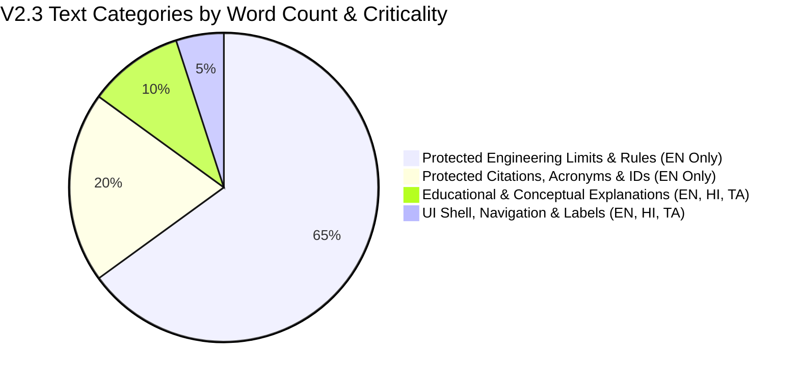
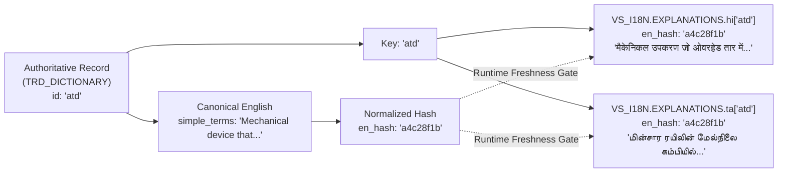
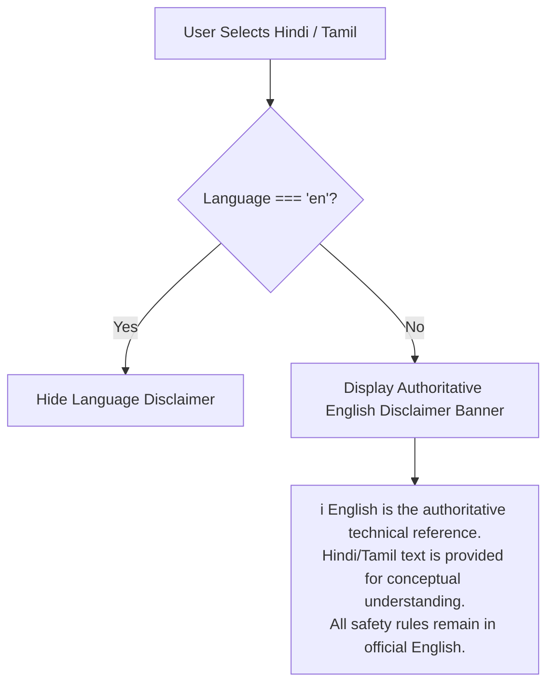
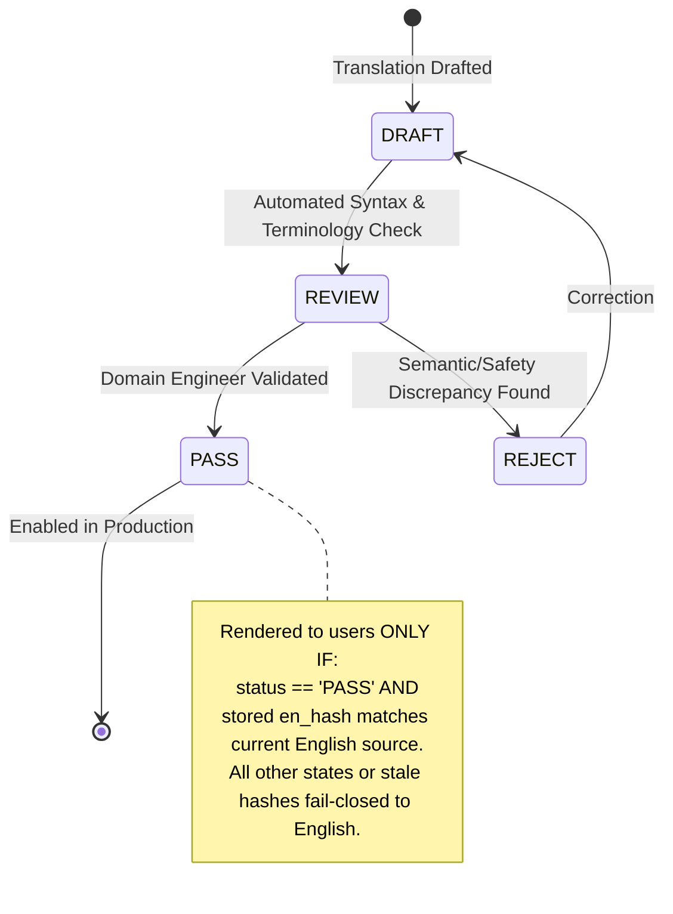
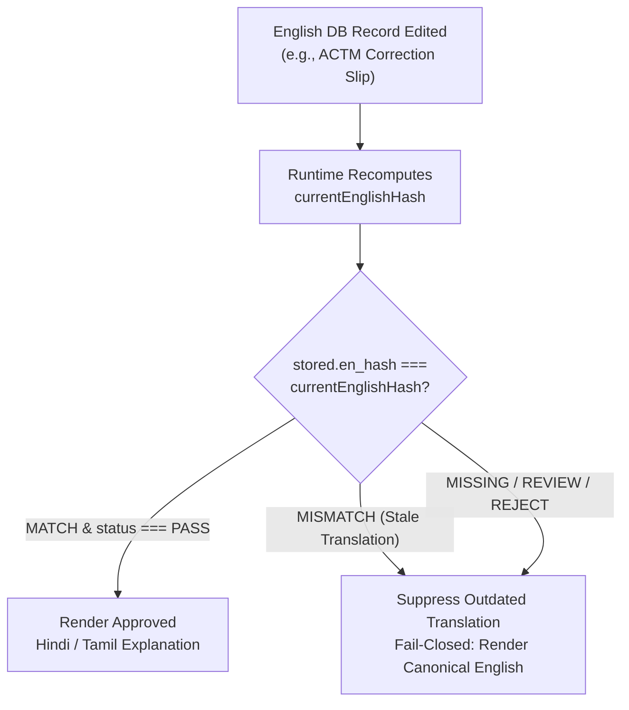

# VisionSafe TRD Engineering Dictionary V2.3
## Localization Architecture Study & Forensics Report
### Accessibility & Explanation Layer: English (Authoritative) • Hindi • Tamil

**Document ID:** `VS-V23-LOCALIZATION-ARCH-STUDY-01`  
**Date:** October 8, 2026  
**Status:** **ANALYSIS & ARCHITECTURE BLUEPRINT (NO IMPLEMENTATION / NO PRODUCTION CHANGES)**  
**Target Repository:** `https://github.com/pettumuyal/VisionSafe-Dictionary-Lab-Public`  
**Current Branch:** `feature/v23-language-localization`  
**Base Commit:** `dda1328dc55d252f0e25df3bd7b20642db2b4639` (`fix(v2.3): remove safety notice timer`)  
**Canonical File Baseline:** `VisionSafe_TRD_Engineering_Dictionary_V2.3.0.html` (SHA-256: `d992f62f7e02d72d54a87d211dbe5b12d3f19e48bae55128055fbd1d6250f92a`)  

---

## 1. Executive Summary

This architecture study investigates the exact mechanics of text storage, rendering, and persistence in the **VisionSafe TRD Engineering Dictionary V2.3** (`v2.3/index.html`). Its purpose is to formulate the smallest, safest, offline-compatible localization architecture supporting:

1. **English (`en`):** The canonical, authoritative, official source language.
2. **Hindi (`hi` — हिन्दी):** An accessibility and conceptual explanation layer.
3. **Tamil (`ta` — தமிழ்):** An accessibility and conceptual explanation layer.
*(Malayalam is strictly excluded per specification).*

### Core Architectural Conclusions:
- **Zero Framework Migration:** The application is a high-performance, zero-dependency, offline Vanilla JS PWA running in a single HTML shell (79,693 lines, ~3.63 MB). It must **not** adopt external libraries (such as `i18next`, React, or Next.js) nor rely on external runtime translation APIs (Google Translate, Gemini API).
- **Engineering Data Freeze:** The authoritative datasets (`TRD_DICTIONARY`, `TRD_REGISTERS`, `TRD_PROCESSES`, `TRD_FIELD` comprising 69,258 lines of vetted engineering knowledge) must **never be duplicated** into localized datasets (e.g., `TRD_DICTIONARY_HI`). Engineering datasets remain the single source of truth in English.
- **Hybrid Localization Architecture (Option C):**
  - **UI Strings:** Stored in a lightweight, structured localization dictionary (`VS_I18N.UI`).
  - **Explanatory Knowledge Overlays:** Non-statutory conceptual explanations (`simple_terms`, `purpose`) are externalized, keyed by **stable record ID** (`VS_I18N.EXPLANATIONS[lang][id]`), and cryptographically/deterministically **bound to canonical English via `en_hash`**.
  - **Fail-Closed Protection:** All safety-critical instructions, statutory rules, ACTM/RDSO citations, drawing numbers, mathematical limits, and technical acronyms are permanently tagged `translation_allowed: false` and rendered in official English. Any missing, unreviewed (`status !== "PASS"`), or stale (`stored.en_hash !== current_hash`) translation defaults immediately to English.
- **Zero Production Impact:** This document is an analysis deliverable only. Zero lines of code, datasets, or service worker assets have been modified in the application.

---

## 2. Current V2.3 Text Architecture

Forensic analysis reveals that text within V2.3 is distributed across three distinct architectural layers:



### 2.1 Static HTML Markup Layer (Lines 6,658–7,020)
Contains the core DOM bones rendered directly by the browser before JavaScript execution:
- Brand lockup: `VisionSafe TRD`, `v2.3`, `ENGINEERING DICTIONARY`.
- Header controls: Theme toggle buttons (`Light`, `Dark`, `Alt`), Settings popover button.
- Settings popover panel: `Application Settings`, `Appearance Theme`, `Reading Size`, preset buttons (`Default`, `Large`, `X-Large`, `Custom`), `Custom scale`, reset button.
- Primary tier tabs: `CONCEPTS` (332), `FIELD` (179), `REGISTER` (104).
- Safety notice overlay: `MANDATORY OPERATIONAL SAFETY NOTICE`, legal/statutory paragraphs, checkbox label, and ENTER button.
- Concept discovery modal overlay: Shell structure with headers, navigation buttons, and startup preference checkbox.
- Search strip: Search input placeholder, discovery button (`Discover`).
- Mobile back bar: `Back to Terms List`.

### 2.2 Embedded Engineering Knowledge Datasets (Lines 7,024–76,281)
Immutable, authoritative JavaScript object arrays declared in global scope:
- `const TRD_DICTIONARY = [...]` (Lines 7,024–30,953): Technical terms, acronyms, categories, simple terms, statutory specs, field checks, citations, and graph relationships.
- `const TRD_REGISTERS = [...]` (Lines 30,954–48,866): Register codes, proformas, periodicities, equipment targets, governing authorities, and inspection fields.
- `const TRD_PROCESSES = [...]` (Lines 48,867–51,339): Multi-step maintenance procedures, tools, safety preconditions, periodicities, and ordered steps.
- `const TRD_FIELD = [...]` (Lines 51,340–76,281): Atomic working knowledge records, purpose, where/what/how to check, acceptance criteria, corrective actions, and multi-tier provenance citations.

### 2.3 Dynamic JavaScript Rendering Layer (Lines 76,288–79,680)
Procedural Vanilla JS functions that construct HTML strings via template literals and inject them into `innerHTML`:
- `renderEntriesList()` (Lines 76,851–76,978): Dynamic card lists for Concepts, Field records, and Registers, including match counts (`X results`) and empty state messages.
- `renderStandardDetail(entry)` (Lines 78,076–78,414): Comprehensive concept view with epistemic cards (`In Simple Terms`, `Engineering Specifications`, `Field Checks & Invariants`, `Governing Citations`).
- `renderFieldDetail(item)` (Lines 77,677–78,074): Field protocol view with operational cards, 4-column parameter grid (`WHEN TO CHECK`, `WHERE TO CHECK`, etc.), and multi-source provenance trees.
- `renderRegisterDetail(reg)` (Lines 77,345–77,675): Register detail view with schedule tabs (`ALL`, `DAILY`, `MONTHLY`, etc.) and collapsible periodicity groups.
- `renderRegisterFieldCard(field, idx)` (Lines 77,170–77,344): Form fields, acceptance limits, typical values, normal ranges, and deviation actions.
- `displayLearningCard(entry)` (Lines 78,688–78,782): Injects concept discovery content dynamically.
- `updateMobileBackButtonText()` (Lines 76,980–76,990): Sets contextual back text (`Back to Concepts`, `Back to Field`, `Back to Registers`).

---

## 3. Static vs Dynamic Text Inventory

The codebase contains approximately **220 distinct UI text strings** and **4 primary knowledge entities**. Below is a forensic audit of actual strings found in the V2.3 source:

| Text Fragment / String | Location in Source | Rendering Type | Proposed Translation Scope | Translation Allowed? | Reason / Architecture Role | Proposed Key / Reference |
| :--- | :--- | :---: | :---: | :---: | :--- | :--- |
| `VisionSafe TRD` | Line 6677 (HTML) | Static | UI Shell | **NO** | Core Product Trademark / Brand Identifier | `BRAND_NAME` (Protected) |
| `ENGINEERING DICTIONARY` | Line 6680 (HTML) | Static | UI Shell | **YES** | Descriptive Product Subtitle | `ui.brand.subtitle` |
| `CONCEPTS` | Line 6799 (HTML) | Static | Navigation Tab | **YES** | Primary Tier Navigation Label | `ui.nav.concepts` |
| `FIELD` | Line 6809 (HTML) | Static | Navigation Tab | **YES** | Primary Tier Navigation Label | `ui.nav.field` |
| `REGISTER` | Line 6820 (HTML) | Static | Navigation Tab | **YES** | Primary Tier Navigation Label | `ui.nav.register` |
| `Application Settings` | Line 6712 (HTML) | Static | Modal Header | **YES** | User Settings Title | `ui.settings.title` |
| `Appearance Theme` | Line 6726 (HTML) | Static | Settings Section | **YES** | Settings Section Title | `ui.settings.theme` |
| `Reading Size` | Line 6743 (HTML) | Static | Settings Section | **YES** | Settings Section Title | `ui.settings.reading_size` |
| `Default` / `Large` / `X-Large` / `Custom` | Lines 6749–6752 (HTML) | Static | Settings Buttons | **YES** | Presets for typography scale | `ui.settings.scale_default`, etc. |
| `Custom scale` | Line 6758 (HTML) | Static | Settings Input | **YES** | Custom scale input label | `ui.settings.custom_scale` |
| `Allowed range: 92–150%` | Line 6764 (HTML) | Static | Settings Helper | **YES** | Input validation range hint | `ui.settings.scale_hint` |
| `Reset to Default` | Line 6781 (HTML) | Static | Settings Button | **YES** | Action button in settings footer | `ui.settings.reset` |
| `Search term, acronym, drawing or clause…` | Line 6958 (HTML) & 79443 (JS) | Static / Dynamic | Input Placeholder | **YES** | Search affordance prompt | `ui.search.placeholder` |
| `Discover` | Line 6971 (HTML) | Static | Toolbar Button | **YES** | Concept Discovery modal trigger | `ui.search.discover` |
| `All Entries` | Line 76495 (JS) | Dynamic | Filter Pill | **YES** | Sidebar category filter option | `ui.filter.all_entries` |
| `⚡ Abbreviations` | Line 76498 (JS) | Dynamic | Filter Pill | **YES** | Sidebar category filter option | `ui.filter.abbreviations` |
| `All Field` | Line 76565 (JS) | Dynamic | Filter Pill | **YES** | Domain filter pill in Field tier | `ui.filter.all_field` |
| `All Processes` | Line 76545 (JS) | Dynamic | Dropdown Option | **YES** | Process filter select default | `ui.filter.all_processes` |
| `All Registers` | Line 76610 (JS) | Dynamic | Filter Pill | **YES** | Category filter pill in Registers tier | `ui.filter.all_registers` |
| `Dictionary Terms` | Line 6990 (HTML) & 76382 (JS) | Static / Dynamic | Sidebar Header | **YES** | Contextual sidebar column title | `ui.sidebar.terms` |
| `Field Protocols` | Line 76383 (JS) | Dynamic | Sidebar Header | **YES** | Contextual sidebar column title | `ui.sidebar.protocols` |
| `Statutory Registers` | Line 76384 (JS) | Dynamic | Sidebar Header | **YES** | Contextual sidebar column title | `ui.sidebar.registers` |
| `Back to Terms List` | Line 7007 (HTML) | Static | Mobile Back Bar | **YES** | Mobile navigation return affordance | `ui.nav.back_terms` |
| `Back to Field` | Line 76984 (JS) | Dynamic | Mobile Back Bar | **YES** | Contextual mobile back affordance | `ui.nav.back_field` |
| `Back to Registers` | Line 76986 (JS) | Dynamic | Mobile Back Bar | **YES** | Contextual mobile back affordance | `ui.nav.back_registers` |
| `No matching engineering terms found.` | Line 76856 (JS) | Dynamic | Empty State | **YES** | Search empty feedback | `ui.empty.terms` |
| `MANDATORY OPERATIONAL SAFETY NOTICE` | Line 6833 (HTML) | Static | Modal Header | **NO** | Statutory Safety Header | `SAFETY_HEADER` (Protected) |
| *"This application provides engineering reference..."* | Lines 6838–6851 (HTML) | Static | Modal Body | **NO** | Authoritative Safety Notice Text | `SAFETY_NOTICE_BODY` (Protected) |
| `I have read and acknowledge this safety notice.` | Line 6857 (HTML) | Static | Checkbox Label | **NO** | Statutory Acknowledgement Clause | `SAFETY_ACK_LABEL` (Protected) |
| `ENTER` | Line 6869 (HTML) | Static | Button | **YES** | Acknowledgment dismissal button | `ui.safety.enter` |
| `CONCEPT DISCOVERY` | Line 6885 (HTML) | Static | Modal Header | **YES** | Educational modal header badge | `ui.discovery.title` |
| `ENGINEERING MEANING` | Line 6895 (HTML) | Static | Modal Section | **YES** | Section label in discovery modal | `ui.discovery.eng_meaning` |
| `IN SIMPLE TERMS` | Line 6900 (HTML) & 78229 (JS) | Static / Dynamic | Section Badge | **YES** | Conceptual explanation header | `ui.section.simple_terms` |
| `Conceptual Summary • Non-Statutory` | Line 78231 (JS) | Dynamic | Section Subtitle | **YES** | Subtitle explicitly scoping non-statutory nature | `ui.section.simple_terms_sub` |
| `Engineering Specifications` | Line 78245 (JS) | Dynamic | Section Badge | **YES** | Section title for technical parameters | `ui.section.specs` |
| `Authoritative Technical Parameters` | Line 78247 (JS) | Dynamic | Section Subtitle | **YES** | Section subtitle | `ui.section.specs_sub` |
| `Field Checks & Invariants` | Line 78261 (JS) | Dynamic | Section Badge | **YES** | Section title for hard tolerances | `ui.section.field_checks` |
| `Hard Tolerances & Statutory Clearances` | Line 78263 (JS) | Dynamic | Section Subtitle | **YES** | Section subtitle | `ui.section.field_checks_sub` |
| `Governing Citations & Drawings` | Line 78279 (JS) | Dynamic | Section Badge | **YES** | Section title for codified standards | `ui.section.citations` |
| `Codified ACTM Clauses & RDSO Drawings` | Line 78281 (JS) | Dynamic | Section Subtitle | **YES** | Section subtitle | `ui.section.citations_sub` |
| `Cross-References & Domain Graph` | Line 78297 (JS) | Dynamic | Section Badge | **YES** | Section title for graph relationships | `ui.section.cross_refs` |
| `Structured TRD Relationships` | Line 78299 (JS) | Dynamic | Section Subtitle | **YES** | Section subtitle | `ui.section.cross_refs_sub` |
| `Copy Reference` | Line 78214 (JS) | Dynamic | Button | **YES** | Action button in concept detail | `ui.actions.copy_ref` |
| `Also known as:` | Line 78206 (JS) | Dynamic | Meta Label | **YES** | Synonyms header | `ui.detail.aka` |
| `Equipment:` / `Process:` / `Source:` | Lines 77850–77858 (JS) | Dynamic | Meta Labels | **YES** | Field detail metadata row labels | `ui.meta.equipment`, etc. |
| `OPERATIONAL PROTOCOL` | Line 77869 (JS) | Dynamic | Section Tag | **YES** | Field card header tag | `ui.field.protocol_tag` |
| `Field Working Instructions` | Line 77870 (JS) | Dynamic | Section Subtitle | **YES** | Field card subtitle | `ui.field.working_inst` |
| `PURPOSE` | Line 77874 (JS) | Dynamic | Parameter Label | **YES** | Field check purpose label | `ui.field.purpose` |
| `WHEN TO CHECK` | Line 77880 (JS) | Dynamic | 4-Col Grid Label | **YES** | Maintenance timing label | `ui.field.when` |
| `WHERE TO CHECK` | Line 77884 (JS) | Dynamic | 4-Col Grid Label | **YES** | Physical location label | `ui.field.where` |
| `WHAT TO CHECK` | Line 77888 (JS) | Dynamic | 4-Col Grid Label | **YES** | Inspection object label | `ui.field.what` |
| `HOW TO CHECK` | Line 77892 (JS) | Dynamic | 4-Col Grid Label | **YES** | Method/action label | `ui.field.how` |
| `ACCEPTANCE & ACTION` | Line 77977 (JS) | Dynamic | Section Tag | **YES** | Acceptance criteria card header | `ui.field.acceptance_tag` |
| `Expected Normal Condition` | Line 77985 (JS) & 77218 (JS) | Dynamic | Condition Header | **YES** | Nominal condition label | `ui.cond.normal` |
| `Abnormal / Condemning Condition` | Line 77992 (JS) & 77226 (JS) | Dynamic | Condition Header | **YES** | Fault / condemning condition label | `ui.cond.abnormal` |
| `ACCEPTANCE CRITERIA` | Line 78000 (JS) | Dynamic | Parameter Label | **YES** | Criteria block title | `ui.field.acceptance_label` |
| `MANDATORY CORRECTIVE ACTION` | Line 78005 (JS) | Dynamic | Parameter Label | **YES** | Action block title | `ui.field.action_label` |
| `STATUTORY SAFETY PRECAUTIONS` | Line 78018 (JS) | Dynamic | Parameter Label | **NO** | Safety precautions block / mandatory safety content | `SAFETY_PRECAUTIONS_HEADER` (Protected) |
| `Expand All` / `Collapse All` | Lines 77418–77419 (JS) | Dynamic | Buttons | **YES** | Register group toggle controls | `ui.reg.expand_all`, etc. |
| `RAILWAY RULE` | Line 76307 (JS) | Dynamic | Action Pill | **YES** | Regulatory classification badge | `ui.badge.railway_rule` |
| `TECHNICAL GUIDANCE` | Line 76309 (JS) | Dynamic | Action Pill | **YES** | Recommended practice badge | `ui.badge.tech_guidance` |
| `ENGINEERING INTERPRETATION` | Line 76311 (JS) | Dynamic | Action Pill | **YES** | Analytical interpretation badge | `ui.badge.eng_interp` |
| `UNDER VERIFICATION` | Line 76305 (JS) | Dynamic | Action Pill | **YES** | Unverified status badge | `ui.badge.under_verif` |
| `⚠ SCOPE-LIMITED` | Line 77841 (JS) & 78200 (JS) | Dynamic | Warning Badge | **YES** | Contextual limitation alert | `ui.badge.scope_limited` |
| `ATD` / `VCB` / `OHE` / `TSS` | Embedded Dataset | Dynamic | Engineering Identifier | **NO** | Core Technical Acronyms | Protected Acronyms |
| `ACTM Vol II Pt 1 Ch 3 Para 20305` | Embedded Dataset | Dynamic | Rule Citation | **NO** | Official Codified Statutory Law | Protected Legal Text |
| `500 mm` / `25 kV` / `85%` | Embedded Dataset | Dynamic | Limit / Dimension | **NO** | Exact Engineering Measurements | Protected Numbers & Units |
| `item.acceptance_criteria` | Embedded Dataset | Dynamic | Statutory Limit | **NO** | Mandatory Physical Pass/Fail Limit | Protected Engineering Limit |
| `item.corrective_action` | Embedded Dataset | Dynamic | Mandatory Action | **NO** | Prescribed Safety Remedy | Protected Action |
| `item.safety_precautions` | Embedded Dataset | Dynamic | Safety Instruction | **NO** | Mandatory Electrical Isolation / PTW | Protected Safety Content |
| `entry.simple_terms` | Embedded Dataset | Dynamic | Non-Statutory Summary | **YES** | Educational Concept Explanation | `expl.concepts[id].simple_terms` |
| `item.purpose` | Embedded Dataset | Dynamic | Non-Statutory Summary | **YES** | Practical Inspection Intent | `expl.field[id].purpose` |

---

## 4. Categorization Matrix: Translatable vs Protected



### 4.1 Categories Eligible for Translation (Accessibility Layer)
These elements convey navigational context, UI state, affordance, and non-statutory conceptual understanding:
1. **Application Shell & Navigation:** Primary tabs (`CONCEPTS`, `FIELD`, `REGISTER`), brand subtitle (`ENGINEERING DICTIONARY`), contextual back button text.
2. **Settings Controls:** Panel headers, theme names (`Light`, `Dark`, `Alt`), reading size presets (`Default`, `Large`, etc.), hints, and reset actions.
3. **Search & Filtering:** Search placeholder prompts, discovery trigger (`Discover`), filter pill labels (`All Entries`, `Abbreviations`, `All Field`, `All Processes`, `All Registers`).
4. **Card & Detail Section Titles:** Card category tags, section banners (`In Simple Terms`, `Engineering Specifications`, `Field Checks & Invariants`, `Governing Citations & Drawings`), 4-column parameter labels (`WHEN TO CHECK`, etc.).
5. **System Feedback & Empty States:** Results count (`X results`), empty search messages, toast notifications (`Reference copied to clipboard`).
6. **Concept Discovery Modal UI:** Button labels (`Next`, `Previous`, `Open Entry`, `Exit`), modal section labels (`ENGINEERING MEANING`, `FIELD CHECK`).
7. **Educational Conceptual Overlays:** High-level non-statutory descriptions (`entry.simple_terms`, `item.purpose`) mapped via external ID lookup.

### 4.2 Categories Permanently Locked in English (Authoritative & Protected)
Translating any element in these categories risks introducing safety ambiguities, violating railway statutory rules, or distorting engineering tolerances:
1. **Mandatory Operational Safety Notice:** Complete startup safety dialog, warning icons, disclaimer text, supervisor rules, and acknowledgement label.
2. **Statutory Safety Warnings & Invariants:** Hard clearances, electrical flashover distances, minimum heights, tension limits, and condemning limits.
3. **Mandatory Field Actions & Remedies:** Corrective action instructions, safety precautions, permit-to-work (PTW) rules, and electrical isolation steps.
4. **Technical Equipment Identifiers & Acronyms:** `OHE`, `PSI`, `ATD`, `VCB`, `TSS`, `SP`, `SSP`, `BM`, `CB`, `PTW`, `SED`, `BWA`, `ACTM`, `RDSO`, `CORE`.
5. **Codified Authority Citations:** Document titles, ACTM clause/paragraph numbers (`ACTM Vol II Para 20305`), RDSO Technical Instructions (`TI/MI/0038`), Indian Standards (`IS: 3043`), IEC specifications.
6. **Engineering Drawing Identifiers:** Official Indian Railways drawing numbers (`ETI/OHE/P/1040`, `RE/33/G/02141`, `SK/TRD/...`) and revisions.
7. **Numerical Values, Formulas & Tolerances:** Exact quantitative values (`25 kV`, `500 mm`, `2.0 m`, `100 A`, `±10 mm`).
8. **Units of Measurement:** Standard SI and railway units (`mm`, `cm`, `m`, `km`, `kV`, `A`, `Hz`, `kgf`, `N`, `deg C`, `micro-ohm`).
9. **Engineering Primary Keys & IDs:** All database keys (`atd`, `WK-OHE-ATD-001`, `OHE-01`, `PROC-OHE-ATD-01`).

---

## 5. Critical Safety-First Architecture & Fail-Closed Guardrails

### 5.1 Fail-Closed Architecture
The localization layer must be designed so that **any failure, missing key, unreviewed draft, or syntax error automatically and safely falls back to canonical English**.

```javascript
// Conceptual Localization Accessor with Fail-Closed Guarantee
function t(key, defaultEnglish) {
  if (currentLanguage === "en") return defaultEnglish;
  
  const res = VS_I18N.UI[currentLanguage];
  if (!res) return defaultEnglish; // Fallback: language bundle missing
  
  const entry = res[key];
  if (!entry) return defaultEnglish; // Fallback: key missing
  
  // Explicit Safety Gate: Only display if QA Status is PASS
  if (entry.status !== "PASS") {
    return defaultEnglish; // Fallback: translation not validated
  }
  
  return entry.text || defaultEnglish;
}
```

### 5.2 Architectural Protection Flag (`translation_allowed: false`)
To prevent future developers or automated scripts from submitting safety-critical texts for translation, the data model explicitly tags non-translatable fields:

```javascript
const SAFETY_GUARD_POLICY = Object.freeze({
  SAFETY_NOTICE: { translation_allowed: false, reason: "Statutory legal notice" },
  FIELD_ACCEPTANCE_LIMITS: { translation_allowed: false, reason: "Physical safety threshold" },
  FIELD_CORRECTIVE_ACTIONS: { translation_allowed: false, reason: "Mandatory railway safety procedure" },
  FIELD_SAFETY_PRECAUTIONS: { translation_allowed: false, reason: "Electrical isolation & PTW requirement" },
  SOURCE_CITATIONS: { translation_allowed: false, reason: "Codified statutory reference" },
  TECHNICAL_IDENTIFIERS: { translation_allowed: false, reason: "Standardized equipment acronym" }
});
```

---

## 6. Engineering Data Localization Strategy

### 6.1 Strict Single Source of Truth
Duplicating `TRD_DICTIONARY` (24,000 lines), `TRD_REGISTERS` (18,000 lines), `TRD_PROCESSES` (2,500 lines), and `TRD_FIELD` (25,000 lines) into separate language files would:
1. Increase repository payload by ~7.5 MB.
2. Create massive maintenance divergence risk.
3. Compromise cryptographic integrity checks.
4. Risk desynchronizing safety limits across languages.

### 6.2 Stable Key / ID Referencing
Instead, the existing datasets remain 100% untouched. Localized conceptual explanations are stored in a parallel lookup structure keyed by the **immutable record ID**:



#### Lookup Implementation (Fail-Closed on Staleness or Missing):
```javascript
function getLocalizedSimpleTerms(entry) {
  if (currentLanguage === "en" || !entry || !entry.id) {
    return entry.simple_terms || "";
  }
  
  const langExplanations = VS_I18N.EXPLANATIONS[currentLanguage];
  if (langExplanations && langExplanations[entry.id]) {
    const item = langExplanations[entry.id];
    // Fail-closed gate: Status must be PASS AND en_hash must match current canonical English source
    if (item.status === "PASS" && item.en_hash === computeEnglishHash(entry.simple_terms)) {
      return item.simple_terms;
    }
  }
  
  // Fail-closed fallback to English (on missing, unreviewed, or stale hash)
  return entry.simple_terms || "";
}
```

---

## 7. Technical Terminology Strategy

Railway traction engineering relies on standardized terms recognized across all railway zones. Translating these terms literally creates severe confusion (e.g., translating *Cantilever* or *Auto-Tensioning Device* into literal vernacular equivalents that no field technician uses).

### Protected Terminology Mapping (`VS_I18N_TERMS`):
```javascript
const VS_I18N_TERMS = Object.freeze({
  "OHE": { en: "OHE", hi: "OHE (ओ.एच.ई.)", ta: "OHE (ஓ.எச்.இ.)", protected: true },
  "ATD": { en: "ATD", hi: "ATD (ऑटो टेंशनिंग डिवाइस)", ta: "ATD (தானியங்கி டென்ஷனிங் கருவி)", protected: true },
  "VCB": { en: "VCB", hi: "VCB (वैक्यूम सर्किट ब्रेकर)", ta: "VCB (வெற்றிட சர்க்யூட் பிரேக்கர்)", protected: true },
  "TSS": { en: "TSS", hi: "TSS (ट्रैक्शन सब-स्टेशन)", ta: "TSS (இழுவை துணை மின்நிலையம்)", protected: true },
  "SP":  { en: "SP",  hi: "SP (सेक्शनिंग पोस्ट)", ta: "SP (பிரிவு இடுகை)", protected: true },
  "SSP": { en: "SSP", hi: "SSP (सब-सेक्शनिंग पोस्ट)", ta: "SSP (துணைப் பிரிவு இடுகை)", protected: true },
  "ACTM": { en: "ACTM", hi: "ACTM", ta: "ACTM", protected: true },
  "RDSO": { en: "RDSO", hi: "RDSO", ta: "RDSO", protected: true }
});
```
**Rule:** Standard technical acronyms always display the canonical English acronym first, optionally followed by an explanatory transliteration in parentheses.

---

## 8. Evaluation of Architectural Options & Selected Recommendation

### 8.1 Option A: Separate External Language Files (`en.js`, `hi.js`, `ta.js`)
- **Structure:** 3 standalone script files loaded via dynamic `<script>` injection.
- **Pros:** Keeps the base HTML size smaller.
- **Cons:** Breaks the offline single-file paradigm; requires service worker precache updates; introduces asynchronous network latency when switching languages; prone to cache desynchronization.

### 8.2 Option B: Monolithic Key-Value Dictionary (`{ key: { en, hi, ta } }`)
- **Structure:** Single inlined dictionary object combining UI keys and record IDs.
- **Pros:** Easy to parse; inlined.
- **Cons:** Intermingles UI chrome strings with large educational knowledge paragraphs; difficult for translators to audit without seeing the full document context; rigid schema.

### 8.3 Option C: Hybrid Structured Localization (RECOMMENDED)
- **Structure:** A unified inlined or companion object `VS_I18N` with two clean operational domains:
  1. `VS_I18N.UI`: Standard UI chrome, buttons, settings, empty states.
  2. `VS_I18N.EXPLANATIONS`: Record-level educational summaries keyed by record ID (`id`).
- **Rationale for Option C Selection:**
  - **100% Offline-Native:** Inlined directly into the application shell, guaranteeing zero network requests and instantaneous language switching.
  - **PWA & SW Preserved:** Operates without requiring complex dynamic fetch interception or service worker rewrite.
  - **Audit Friendly:** Translators work on UI chrome independently from conceptual educational overlays.
  - **Zero Knowledge Duplication:** Existing 69,258 lines of engineering datasets remain untouched.

---

## 9. Recommended File & Object Structure

```javascript
/* ==========================================================================
   VisionSafe TRD Localization Architecture (Option C: Hybrid)
   ========================================================================== */

const VS_I18N = {
  // Current active language: 'en' | 'hi' | 'ta'
  activeLang: "en",

  // 1. UI Chrome, Navigation, Labels, and Alerts
  UI: {
    en: {
      "brand.subtitle": { text: "ENGINEERING DICTIONARY", status: "PASS" },
      "nav.concepts": { text: "CONCEPTS", status: "PASS" },
      "nav.field": { text: "FIELD", status: "PASS" },
      "nav.register": { text: "REGISTER", status: "PASS" },
      "settings.title": { text: "Application Settings", status: "PASS" },
      "settings.theme": { text: "Appearance Theme", status: "PASS" },
      "settings.reading_size": { text: "Reading Size", status: "PASS" },
      "settings.language": { text: "Language", status: "PASS" },
      "search.placeholder": { text: "Search term, acronym, drawing or clause…", status: "PASS" },
      "search.discover": { text: "Discover", status: "PASS" },
      "filter.all_entries": { text: "All Entries", status: "PASS" },
      "filter.abbrev": { text: "⚡ Abbreviations", status: "PASS" },
      "sidebar.terms": { text: "Dictionary Terms", status: "PASS" },
      "sidebar.protocols": { text: "Field Protocols", status: "PASS" },
      "sidebar.registers": { text: "Statutory Registers", status: "PASS" },
      "section.simple_terms": { text: "In Simple Terms", status: "PASS" },
      "section.simple_terms_sub": { text: "Conceptual Summary • Non-Statutory", status: "PASS" },
      "section.specs": { text: "Engineering Specifications", status: "PASS" },
      "section.field_checks": { text: "Field Checks & Invariants", status: "PASS" },
      "section.citations": { text: "Governing Citations & Drawings", status: "PASS" },
      "section.cross_refs": { text: "Cross-References & Domain Graph", status: "PASS" },
      "disclaimer.text": {
        text: "English is the authoritative technical reference. Hindi and Tamil translations are provided solely for accessibility and conceptual understanding. All safety instructions and statutory limits remain in official English.",
        status: "PASS"
      }
    },
    hi: {
      "brand.subtitle": { text: "इंजीनियरिंग डिक्शनरी", status: "PASS" },
      "nav.concepts": { text: "अवधारणाएं", status: "PASS" },
      "nav.field": { text: "फील्ड प्रोटोकॉल", status: "PASS" },
      "nav.register": { text: "रजिस्टर", status: "PASS" },
      "settings.title": { text: "एप्लिकेशन सेटिंग्स", status: "PASS" },
      "settings.theme": { text: "थीम (दिखावट)", status: "PASS" },
      "settings.reading_size": { text: "पढ़ने का आकार", status: "PASS" },
      "settings.language": { text: "भाषा (Language)", status: "PASS" },
      "search.placeholder": { text: "शब्द, संक्षिप्त नाम, ड्राइंग या क्लॉज खोजें…", status: "PASS" },
      "search.discover": { text: "खोजें (Discover)", status: "PASS" },
      "filter.all_entries": { text: "सभी प्रविष्टियां", status: "PASS" },
      "filter.abbrev": { text: "⚡ संक्षिप्त नाम", status: "PASS" },
      "sidebar.terms": { text: "डिक्शनरी शब्द", status: "PASS" },
      "sidebar.protocols": { text: "फील्ड प्रोटोकॉल", status: "PASS" },
      "sidebar.registers": { text: "वैधानिक रजिस्टर", status: "PASS" },
      "section.simple_terms": { text: "सरल शब्दों में", status: "PASS" },
      "section.simple_terms_sub": { text: "वैचारिक सारांश • गैर-सांविधिक", status: "PASS" },
      "section.specs": { text: "इंजीनियरिंग विनिर्देश", status: "PASS" },
      "section.field_checks": { text: "फील्ड जांच एवं नियम", status: "PASS" },
      "section.citations": { text: "मानक संदर्भ एवं चित्र", status: "PASS" },
      "section.cross_refs": { text: "पारस्परिक संदर्भ एवं संबंध", status: "PASS" },
      "disclaimer.text": {
        text: "अंग्रेजी आधिकारिक तकनीकी संदर्भ है। हिन्दी अनुवाद केवल सुलभता और वैचारिक समझ के लिए प्रदान किया गया है। सभी सुरक्षा निर्देश और वैधानिक नियम आधिकारिक अंग्रेजी में ही मान्य हैं।",
        status: "PASS"
      }
    },
    ta: {
      "brand.subtitle": { text: "பொறியியல் அகராதி", status: "PASS" },
      "nav.concepts": { text: "கருத்துக்கள்", status: "PASS" },
      "nav.field": { text: "கள நெறிமுறைகள்", status: "PASS" },
      "nav.register": { text: "பதிவேடுகள்", status: "PASS" },
      "settings.title": { text: "பயன்பாட்டு அமைப்புகள்", status: "PASS" },
      "settings.theme": { text: "வண்ண தீம்", status: "PASS" },
      "settings.reading_size": { text: "எழுத்து அளவு", status: "PASS" },
      "settings.language": { text: "மொழி (Language)", status: "PASS" },
      "search.placeholder": { text: "சொல், சுருக்கம், வரைபடம் அல்லது விதியைத் தேடுக…", status: "PASS" },
      "search.discover": { text: "கண்டறிக (Discover)", status: "PASS" },
      "filter.all_entries": { text: "அனைத்து உள்ளீடுகள்", status: "PASS" },
      "filter.abbrev": { text: "⚡ சுருக்கங்கள்", status: "PASS" },
      "sidebar.terms": { text: "அகராதி சொற்கள்", status: "PASS" },
      "sidebar.protocols": { text: "கள நெறிமுறைகள்", status: "PASS" },
      "sidebar.registers": { text: "சட்டப்பூர்வ பதிவேடுகள்", status: "PASS" },
      "section.simple_terms": { text: "எளிய விளக்கம்", status: "PASS" },
      "section.simple_terms_sub": { text: "கருத்து சுருக்கம் • சட்டபூர்வமற்றது", status: "PASS" },
      "section.specs": { text: "பொறியியல் விவரக்குறிப்புகள்", status: "PASS" },
      "section.field_checks": { text: "கள சோதனைகள் மற்றும் வரம்புகள்", status: "PASS" },
      "section.citations": { text: "விதிகள் மற்றும் வரைபட குறிப்புகள்", status: "PASS" },
      "section.cross_refs": { text: "தொழில்நுட்ப தொடர்புகள்", status: "PASS" },
      "disclaimer.text": {
        text: "ஆங்கில பதிப்பே அதிகாரப்பூர்வ தொழில்நுட்ப குறிப்பு ஆகும். தமிழ் மொழிபெயர்ப்பு எளிதில் புரிந்துகொள்வதற்காக மட்டுமே வழங்கப்பட்டுள்ளது. அனைத்து பாதுகாப்பு வழிமுறைகளும் அதிகாரப்பூர்வ ஆங்கிலத்திலேயே பொருந்தும்.",
        status: "PASS"
      }
    }
  },

  // 2. Educational & Conceptual Summaries Keyed by Stable Record ID & Bound by en_hash
  EXPLANATIONS: {
    hi: {
      "atd": {
        simple_terms: "ऑटो टेंशनिंग डिवाइस (ATD) एक पुली और वजन वाली प्रणाली है जो मौसम के अनुसार तार के फैलाव या सिकुड़न के बावजूद ओवरहेड तार (OHE) के तनाव को एक समान बनाए रखती है।",
        status: "PASS",
        en_hash: "a4c28f1b" // 32-bit FNV-1a hash of normalized English simple_terms
      }
    },
    ta: {
      "atd": {
        simple_terms: "தானியங்கி டென்ஷனிங் சாதனம் (ATD) என்பது புல்லிகள் மற்றும் எடைகளைக் கொண்ட ஒரு அமைப்பாகும். இது வெப்பநிலை மாற்றங்களால் கம்பி விரிவடையும் போதும் சுருங்கும் போதும் மேல்நிலை கம்பியின் (OHE) இழுவிசையை சீராக பராமரிக்கிறது.",
        status: "PASS",
        en_hash: "a4c28f1b" // 32-bit FNV-1a hash of normalized English simple_terms
      }
    }
  }
};
```

---

## 10. Application Settings Integration Point

### 10.1 HTML Insertion Location
Forensic inspection of `#settingsPopover` (lines 6,722–6,773) shows that settings sections are stacked neatly inside `.settings-popover-body`. The safest insertion point for the Language selector is immediately after **Appearance Theme** and before **Reading Size**:

```html
<!-- Line ~6739: Insert immediately after Appearance Theme section -->
<div class="settings-section">
  <div class="settings-section-header">
    <span class="settings-section-title">Language</span>
  </div>
  <div class="settings-theme-row" role="radiogroup" aria-label="Language options">
    <button type="button" class="settings-theme-btn active" id="langOptionEn" data-lang-val="en" role="radio" aria-checked="true">
      <span>English</span>
    </button>
    <button type="button" class="settings-theme-btn" id="langOptionHi" data-lang-val="hi" role="radio" aria-checked="false">
      <span>हिन्दी</span>
    </button>
    <button type="button" class="settings-theme-btn" id="langOptionTa" data-lang-val="ta" role="radio" aria-checked="false">
      <span>தமிழ்</span>
    </button>
  </div>
</div>
```

### 10.2 JavaScript Wiring & Persistence
Adopting the exact pattern used by `initTheme()` and `initReadingScale()`:
- **Storage Key:** `visionsafe_language`
- **Fallback Value:** `"en"` (English)
- **Lifecycle Execution:**
  ```javascript
  const LANGUAGE_STORAGE_KEY = "visionsafe_language";
  let currentLanguage = "en";

  function initLanguage() {
    let savedLang = "en";
    try {
      savedLang = localStorage.getItem(LANGUAGE_STORAGE_KEY) || "en";
    } catch (e) {
      savedLang = "en";
    }
    setLanguage(savedLang, false);
  }

  function setLanguage(lang, saveToStorage = true) {
    if (lang !== "en" && lang !== "hi" && lang !== "ta") {
      lang = "en";
    }
    currentLanguage = lang;
    VS_I18N.activeLang = lang;

    if (saveToStorage) {
      try {
        localStorage.setItem(LANGUAGE_STORAGE_KEY, lang);
      } catch (e) {}
    }

    // Update active button state
    document.querySelectorAll("[data-lang-val]").forEach(btn => {
      const isAct = btn.getAttribute("data-lang-val") === lang;
      btn.classList.toggle("active", isAct);
      btn.setAttribute("aria-checked", isAct ? "true" : "false");
    });

    // Update static HTML shell nodes
    updateStaticLocalizedUI();

    // Re-render active view
    if (typeof initCategoryPills === "function") initCategoryPills();
    if (typeof renderEntriesList === "function") renderEntriesList();
    if (typeof renderDetail === "function") {
      const activeEntry = getActiveEntryObject();
      if (activeEntry) renderDetail(activeEntry);
    }
  }
  ```

---

## 11. Translation Disclaimer Architecture

When Hindi or Tamil is selected, the application must display a clear, non-intrusive legal/technical disclaimer at the base of readable content:



### UI Implementation:
Placed cleanly above the detail viewport footer:
```html
<div class="language-disclaimer-banner" id="langDisclaimerBanner" style="display: none;">
  <span class="disclaimer-icon">ℹ️</span>
  <span class="disclaimer-text" id="langDisclaimerText"></span>
</div>
```

---

## 12. Translation QA Architecture & Status Model



### 12.1 Four-State Translation Status Model
Every localized entry contains an explicit `status` property:
1. `PASS`: Fully validated by a qualified TRD domain engineer. Deployed to users **only if `en_hash` matches current English**.
2. `REVIEW`: Draft completed; awaiting technical engineering review. **Runtime fails-closed to English.**
3. `REJECT`: Flagged for technical inaccuracy, omitted conditions, or altered meaning. **Runtime fails-closed to English.**
4. `NOT_TRANSLATABLE`: Permanent flag on safety-critical, mathematical, or codified parameters.

> **Automatic Staleness Demotion:** Even if an entry is marked `PASS`, any change to the canonical English source immediately invalidates the translation at runtime because `stored.en_hash !== currentEnglishHash`. The runtime accessor automatically and safely falls back to current English without requiring manual status demotion.

### 12.2 Five-Stage Validation Workflow
Before any string moves to `PASS`, it must pass five verification checks:
1. **Terminology Check:** Verify technical terms matching `VS_I18N_TERMS` were not replaced with incorrect literal translations.
2. **Numeric & Unit Preservation Check:** Verify mathematical numbers (`25`, `500`), tolerances (`±10`), and units (`kV`, `mm`) are bitwise identical.
3. **Safety Boundary Audit:** Confirm that zero safety-critical instructions or condemning limits were altered.
4. **Semantic Comparison:** Verify no conditions were omitted (e.g., confusing "mandatory" with "optional", or omitting "when energized").
5. **Back-Translation Check:** Independent back-translation from Hindi/Tamil back to English to check fidelity.

---

## 13. Translation Freshness Binding / en_hash Architecture

### 13.1 Foundational Invariant: English as the Sole Source of Truth
English engineering knowledge is canonical, authoritative, and legally governing. Hindi and Tamil are non-statutory accessibility and explanatory overlays. Under no circumstances may a vernacular translation dictate, alter, or delay the release of English engineering updates.
- **Immediate English Publication:** Any English update—whether an ACTM Correction Slip, RDSO revision, numerical tolerance fix, periodicity update, or new equipment entry—can and must be published immediately to production.
- **Subordinate Localization:** The translation layer is strictly read-only relative to the engineering data arrays (`TRD_DICTIONARY`, `TRD_FIELD`, `TRD_REGISTERS`, `TRD_PROCESSES`).

### 13.2 The `en_hash` Mechanism: Automated Zero-Touch Staleness Detection
To prevent the silent display of outdated vernacular explanations alongside updated English engineering parameters, every translated entry in `VS_I18N.EXPLANATIONS` must contain an `en_hash` field. This stores a deterministic fingerprint of the exact canonical English source text from which the translation was generated.



**Zero Developer Discipline:** The system eliminates all reliance on developer memory. An engineer updating English records tomorrow does NOT need to increment a version number, edit translation files, or demote translation statuses. The runtime accessor immediately detects the hash mismatch and suppresses stale translations automatically.

### 13.3 Scope of Hashing: Translatable English Fields Only
The hash binds **only to the specific translatable English field** represented by the explanation. It does **not** hash the complete engineering record.

* **For Concepts (`TRD_DICTIONARY`):**
  $$\text{en\_hash} = \text{hash}(\text{normalize}(\text{TRD\_DICTIONARY.simple\_terms}))$$
* **For Field Requirements (`TRD_FIELD`):**
  $$\text{en\_hash} = \text{hash}(\text{normalize}(\text{TRD\_FIELD.purpose}))$$

#### Fields Explicitly EXCLUDED from Hashing:
The following fields are strictly excluded from the hash:
1. Statutory safety precautions (`safety_precautions`)
2. Acceptance criteria and limits (`acceptance_criteria`)
3. Mandatory corrective actions (`corrective_action`)
4. Codified citations (`source`, ACTM clause, RDSO guidelines)
5. Engineering drawing numbers (`drawing_no`)
6. Numerical measurements, tolerances, and units (`25 kV`, `500 mm`)
7. Equipment codes and acronyms (`OHE`, `ATD`, `VCB`, `TSS`)
8. Primary record keys and IDs (`id`)
9. Statutory register forms and maintenance periodicities (`TRD_REGISTERS`)
10. Multi-step procedural sequences (`TRD_PROCESSES`)

*Rationale:* If the hash bound to the complete engineering record, correcting an ACTM paragraph citation or drawing reference would invalidate the conceptual explanation even when the concept itself remained identical. Hashing only the translatable string eliminates false-positive staleness.

### 13.4 Normalization Rules
Prior to fingerprint calculation, the canonical English string is normalized using the standard rule:
```javascript
function normalizeSource(text) {
  if (typeof text !== "string") return "";
  return text.trim().replace(/\s+/g, " ");
}
```
**Strict Normalization Boundaries:**
- **DO NOT** convert to lowercase (preserves capitalization of technical acronyms).
- **DO NOT** alter punctuation (colons, dashes, and periods convey engineering syntax).
- **DO NOT** strip engineering terms or mathematical units.
- **DO NOT** normalize numbers or SI units.
*Purpose:* Strips irrelevant whitespace and line breaks caused by source-file formatting while detecting any substantive modification to English words, numbers, or phrasing.

### 13.5 Deterministic Hash Algorithm (FNV-1a 32-Bit)
The application standardizes on **FNV-1a 32-bit**, producing an 8-character hexadecimal string:
- **Offline & Self-Contained:** Executes in ~6 lines of Vanilla JavaScript without external dependencies.
- **Fast Execution:** Evaluates in microseconds per record with zero runtime overhead.
- **Not a Cryptographic Security Barrier:** The purpose of `en_hash` is deterministic freshness binding and cache verification, not cryptographic access control. The authoritative English dataset itself remains the single source of truth.

```javascript
// Lightweight FNV-1a 32-bit Hash Specification
function computeEnglishHash(str) {
  const normalized = (str || "").trim().replace(/\s+/g, " ");
  let hash = 0x811c9dc5;
  for (let i = 0; i < normalized.length; i++) {
    hash ^= normalized.charCodeAt(i);
    hash = Math.imul(hash, 0x01000193);
  }
  return (hash >>> 0).toString(16).padStart(8, "0");
}
```

### 13.6 Runtime Fail-Closed Validation Rule
A localized explanation renders if and only if:
$$\text{renderTranslation} = (\text{item.status} === \text{"PASS"})\ \land\ (\text{item.en\_hash} === \text{computeEnglishHash}(\text{entry[field]}))$$
If any condition is false:
$$\text{FALLBACK} \rightarrow \text{renderCanonicalEnglish()}$$

> **Explicit Rule on Missing `en_hash`:** If `en_hash` is absent from a translation entry, the hash gate fails closed and canonical English is served. Absence is treated equivalently to a hash mismatch. This is intentional architectural behavior, not merely an accidental JavaScript `undefined` comparison. A translation entry without an explicit, matching `en_hash` is unpinned and invalid; only an explicit `status === "PASS"` AND verified matching `en_hash` permits translated rendering.

### 13.7 Handling of English Knowledge Lifecycle Events
1. **English Record Edited:** The runtime hash of the new English string mismatches `item.en_hash`. Stale vernacular is suppressed; new English renders immediately.
2. **New Record Added:** Record ID is absent in `VS_I18N.EXPLANATIONS`. Accessor returns `undefined`; canonical English renders immediately without runtime machine translation.
3. **Missing / REVIEW / REJECT:** Fails status check; falls back cleanly to English.
4. **Record Deleted:** Removed from English dataset. UI never queries deleted ID; translation entry remains dormant and inert.
5. **Record Superseded:** Superseded ID is retired; new superseding ID starts English-first until translated.
6. **Record ID Renamed:** The new ID starts English-first. The old translation key does not automatically attach to the new ID.
7. **Record Split ($A \rightarrow A1 + A2$):** $A1$ and $A2$ start English-first. Old composite translation $A$ is never copied automatically.
8. **Record Merge ($A + B \rightarrow C$):** $C$ starts English-first. Old constituent translations $A$ and $B$ are never copied automatically.
9. **Orphan Translations (Future Hygiene Only):** Any key in `VS_I18N.EXPLANATIONS` whose ID does not exist in canonical English datasets is an orphan. Orphans never render at runtime because the UI iterates exclusively over active English datasets. A future maintenance utility, callable from the browser console or as a standalone script, may enumerate orphan translation IDs by iterating `VS_I18N.EXPLANATIONS` and checking whether each ID exists in the live English datasets. Orphan cleanup is future hygiene only and is not a runtime safety prerequisite.
10. **Protected Field Changes Outside Translation Overlay:** Changes to protected fields such as source citations, numerical values, tolerances, periodicities, procedure steps, and structural engineering requirements are outside the translation overlay. The `en_hash` is not computed over these fields. These changes do not create translation validity through the overlay; the protected content remains canonical English and is rendered unconditionally.

### 13.8 PWA Single-Shell Architecture & Offline Guarantees
- **Atomic Inlining:** All localization tables (`VS_I18N`) reside within the single HTML shell (`v2.3/index.html`).
- **Zero Cache-Skew:** Because English datasets and translation dictionaries are bundled in the exact same file, the PWA Service Worker updates them atomically. It is impossible for an updated English dataset to run against an outdated translation script.
- **Offline Determinism:** Hash comparison runs entirely client-side in memory with zero network calls.

### 13.9 Safety Invariant Preservation
Safety-critical elements (Mandatory Operational Safety Notice, electrical clearances, PTW rules, condemning limits, corrective actions) have no lookup accessors in `VS_I18N` and are permanently locked in English. No localization failure, hash mismatch, or corrupted entry can alter safety instructions.

---

## 14. Architecture Scenario Matrix

The following matrix defines the deterministic runtime behavior across all 18 engineering and localization lifecycle events:

| # | Scenario | English Result | Translation Result | Runtime Behavior |
| :-: | :--- | :--- | :--- | :--- |
| **1** | Existing English unchanged | Unchanged | `status === "PASS"`, `en_hash` matches | Displays approved Hindi / Tamil translation. |
| **2** | Existing English edited | Updated to new content | `en_hash` mismatches current English | **Fail-closed:** Suppresses stale translation; displays updated English. |
| **3** | Source correction (ACTM/RDSO citation) | Updated in English dataset | Non-translatable field; hash unaffected | Displays updated citation in English; translation remains active. |
| **4** | Numerical change (hard tolerance/limit) | Updated in English dataset | Non-translatable field; hash unaffected | Displays updated numerical limit in English; translation remains active. |
| **5** | Periodicity change | Updated in English dataset | Non-translatable field; hash unaffected | Displays updated schedule in English; translation remains active. |
| **6** | New record added | Added to English dataset | ID absent in `VS_I18N.EXPLANATIONS` | **Fail-closed:** Displays new English record immediately. |
| **7** | Deleted record | Removed from English dataset | ID remains in translation bundle | Record not rendered by UI; translation remains inert dead data. |
| **8** | Superseded record | Deprecated / replaced by new ID | Old translation bound to old ID | UI renders new record English-first; old translation never displayed. |
| **9** | Record ID renamed | ID changed in English dataset | Old ID exists, new ID absent | **Fail-closed:** New ID renders English-first; old translation inert. |
| **10** | Split ($A \rightarrow A1 + A2$) | Records $A1$ and $A2$ created | $A1$ and $A2$ absent in translation bundle | **Fail-closed:** Both render English-first; old $A$ translation inert. |
| **11** | Merge ($A + B \rightarrow C$) | Merged record $C$ created | $C$ absent in translation bundle | **Fail-closed:** $C$ renders English-first; old $A, B$ translations inert. |
| **12** | Missing translation | Canonical English exists | Key absent in `VS_I18N.EXPLANATIONS` | **Fail-closed:** Displays canonical English immediately. |
| **13** | REVIEW translation | Canonical English exists | `status === "REVIEW"` | **Fail-closed:** Displays canonical English immediately. |
| **14** | REJECT translation | Canonical English exists | `status === "REJECT"` | **Fail-closed:** Displays canonical English immediately. |
| **15** | Hindi stale / Tamil current | Canonical English edited | Hindi `en_hash` mismatches; Tamil updated | Hindi displays English fallback; Tamil displays approved translation. |
| **16** | Tamil stale / Hindi current | Canonical English edited | Tamil `en_hash` mismatches; Hindi updated | Tamil displays English fallback; Hindi displays approved translation. |
| **17** | Orphan translation | ID absent in English datasets | Translation entry exists in bundle | UI never queries ID; translation never rendered; flagged in audit. |
| **18** | Offline / PWA update | Cached in single HTML shell | Inlined alongside English datasets | PWA updates atomically; hash validation runs 100% offline. |

---

## 15. Implementation Contract — Future Phase

When implementation is explicitly authorized, the localization subsystem must adhere strictly to the following implementation contract:

1. **Deterministic Hashing:** Implement standard FNV-1a 32-bit hashing producing consistent 8-character hex strings across all platforms.
2. **Mandatory `en_hash` Storage:** Every explanation object in `VS_I18N.EXPLANATIONS` must persist its source `en_hash`.
3. **Runtime Freshness Verification:** All explanatory render functions (`getLocalizedSimpleTerms`, `getLocalizedPurpose`) must verify both `status === "PASS"` and hash equality prior to rendering.
4. **Universal English Fallback:** Any error, missing key, unassigned language, or hash discrepancy must fail-closed to canonical English.
5. **Localization Reporting Tools:** Provide developer console/audit utilities to enumerate:
   - Missing translations (`count` and IDs)
   - Stale translations (`stored.en_hash !== current_hash`)
   - Orphan translations (`translation_id` not found in English datasets)
6. **Split/Merge/Delete Safety:** Ensure new IDs never inherit translations from split, merged, or renamed parents without explicit translation review.
7. **No Runtime Machine Translation:** Strictly zero algorithmic, automated, or network-based translations at runtime.
8. **Immutable Core Datasets:** Zero additions of version properties or mutations to `TRD_DICTIONARY`, `TRD_FIELD`, `TRD_REGISTERS`, or `TRD_PROCESSES`.
9. **Zero Safety Dependency:** Safety notice, operational precautions, and corrective actions must never have localized lookup bindings.

> **CRITICAL ARCHITECTURAL BOUNDARY:**  
> **THIS DOCUMENTATION AMENDMENT DOES NOT IMPLEMENT ANY OF THE ABOVE.**  
> It establishes the binding specification. The application source code, datasets, service worker, and production builds remain 100% untouched.

---

## 16. Phased Implementation Roadmap (For Future Work)

When implementation is authorized, work must follow five surgical phases:

```text
Phase 1: Foundation Engine
├── Define VS_I18N structure and t() accessor function
├── Implement computeEnglishHash() (FNV-1a 32-bit) & normalizeSource()
├── Add Language selector to Settings popover (HTML)
├── Implement initLanguage() and localStorage persistence
└── Add language disclaimer banner component

Phase 2: UI Chrome Localization
├── Localize primary navigation tabs (CONCEPTS, FIELD, REGISTER)
├── Localize search bar placeholder and discovery button
├── Localize filter pill labels and empty state messages
└── Localize card headers and detail section title tags

Phase 3: Concept Discovery & Simple Terms
├── Externalize simple_terms for TRD_DICTIONARY into VS_I18N.EXPLANATIONS (with en_hash)
├── Update renderStandardDetail() to consume getLocalizedSimpleTerms() with hash validation
└── Localize Concept Discovery modal UI and labels

Phase 4: Field & Register Explanatory Overlays
├── Externalize item.purpose for TRD_FIELD into VS_I18N.EXPLANATIONS (with en_hash)
├── Localize non-statutory register spec labels
└── Localize periodicity schedule titles

Phase 5: Verification & Production Release
├── Comprehensive Playwright testing across 10 viewports
├── Validate en_hash staleness suppression and English fallback
├── Offline PWA validation and cache version bump (visionsafe-v23-005)
└── Production release report
```

---

## 17. Risks & Defensive Safeguards

| # | Identified Risk | Impact Level | Architectural Mitigation |
| :-: | :--- | :---: | :--- |
| **1** | Accidental translation of safety-critical instruction | **CRITICAL** | Tag fields `translation_allowed: false`. Exclude `safety_precautions` and `corrective_action` from localization layer entirely. |
| **2** | Stale translations misrepresenting updated English knowledge | **CRITICAL** | Mandatory `en_hash` binding. Mismatch automatically suppresses translation and defaults to English. |
| **3** | Mistranslation of quantitative technical limits | **HIGH** | Numerical limits and tolerances are hard-coded in English. The localization layer only touches non-statutory summaries. |
| **4** | Runtime dependency on external translation APIs | **HIGH** | Strict offline PWA design. Zero external API calls. All resources bundled statically. |
| **5** | Broken layout due to longer Indic text strings | **MEDIUM** | Use flexbox wrapping and overflow protection. Test on 360px–430px mobile screens during QA. |
| **6** | Divergence between English and vernacular knowledge | **HIGH** | Single Source of Truth architecture. No separate Hindi/Tamil database arrays. All translations reference English master IDs with hash freshness. |
| **7** | Stale PWA cache pinning older language bundles | **MEDIUM** | Increment PWA cache revision upon final release (`visionsafe-v23-005`). |

---

## 18. Explicit Boundaries: What NOT to Change

During any future localization work, the following parts of the codebase are strictly protected and **MUST NOT BE CHANGED**:

1. **DO NOT modify the root V2.1 baseline** (`/index.html`, `/manifest.webmanifest`, `/sw.js`, `/icons/`).
2. **DO NOT duplicate or split the engineering datasets** (`TRD_DICTIONARY`, `TRD_REGISTERS`, `TRD_PROCESSES`, `TRD_FIELD`).
3. **DO NOT translate the Mandatory Operational Safety Notice** (`#safetyNoticeOverlay`).
4. **DO NOT translate safety-critical instructions, acceptance limits, or corrective actions**.
5. **DO NOT translate document numbers, ACTM clauses, RDSO technical instructions, or drawing numbers**.
6. **DO NOT translate or convert numerical values, tolerances, formulas, or units of measurement**.
7. **DO NOT remove or weaken the English-first technical terminology**.
8. **DO NOT redesign Application Settings** (only add the 3-button Language row).
9. **DO NOT introduce external frameworks, libraries, or network APIs**.
10. **DO NOT add Malayalam** (strictly English, Hindi, and Tamil).

---

## 19. Audit & File Verification

### Working Tree Verification:
- Canonical Source: `/home/nidhin/Register_info/VisionSafe_TRD_Engineering_Dictionary_V2.3.0.html` (SHA-256: `d992f62f7e02d72d54a87d211dbe5b12d3f19e48bae55128055fbd1d6250f92a`) — **UNTOUCHED**
- Published V2.3 Shell: `v2.3/index.html` (SHA-256: `d992f62f7e02d72d54a87d211dbe5b12d3f19e48bae55128055fbd1d6250f92a`) — **UNTOUCHED**
- Published SW: `v2.3/sw.js` — **UNTOUCHED**
- Root Baseline (V2.1): `index.html`, `sw.js` — **UNTOUCHED**
- Report Created: `V23_LOCALIZATION_ARCHITECTURE_STUDY.md` — **AMENDED ARCHITECTURE SPECIFICATION ONLY**
